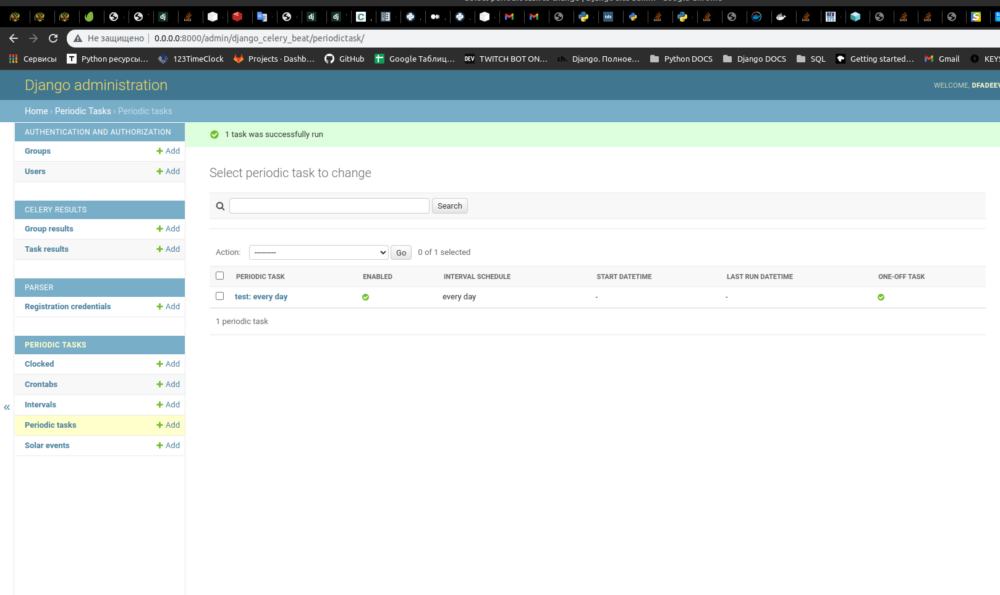
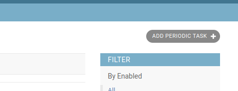
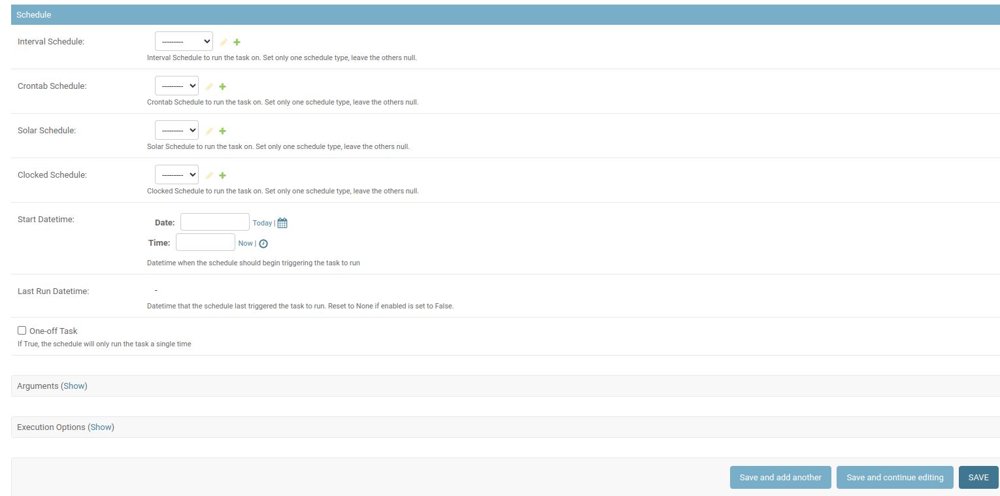
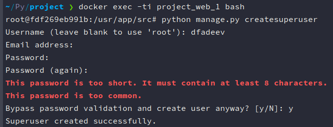
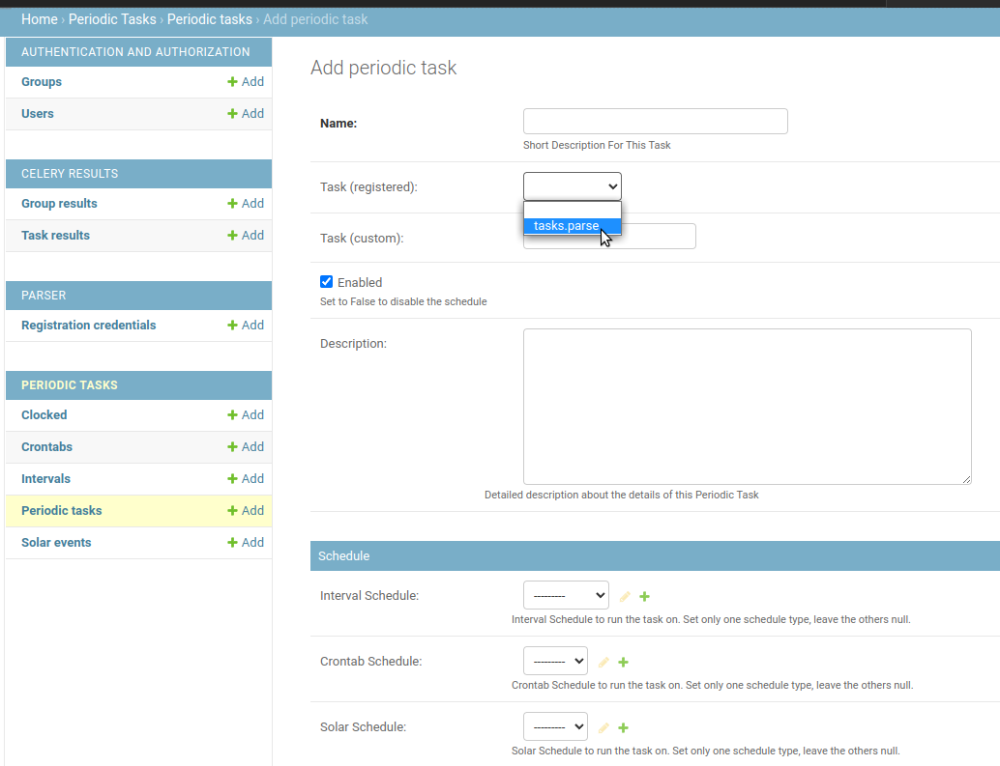

# Web parser 

## Microservice for creating, managing and running periodic tasks

Parser set an http connection to the site 'zakupki.gov.ru', retrieving 
organization credentials from html tags with requests and bs4, and save 
it to postgres db

Celery provides an admin interface added to django admin site, to manage
periodic tasks

Add new periodic task by selecting 'add periodic task' button

You can choose a db schedule for every created task, and it will be executed
on the background

### Depends:

* Python ^3.8
* Django ^3.2.13
* Celery ^5.2.6
* django-celery-beat ^2.2.1
* requests ^2.27.1
* beautifulsoup4 ^4.11.1

To build containers and run the app, you can run command:

> 'docker-compose up --build'

Admin site will be available on **0.0.0.0:8000/admin**

To log in into admin site, execute command in the main app container:

> 'python manage.py createsuperuser'

Next set the superuser name, password (Email are optional, you can
live it empty and press 'enter' to skip)

Finally you should see a message 'Superuser create successfully'

Enter new login/password and log in

Choose 'Periodic tasks' and create a new task

After saving, you can run the task immediately by selecting it,
choose an action 'Run selected tasks' and press go
